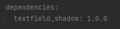
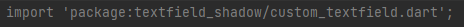
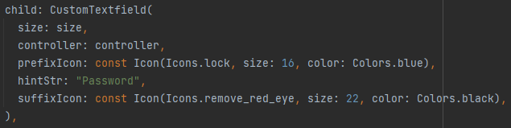

#Description
This package to create simple and attractive Textfield with your Customization.

##Getting started
Add the following to your pubspec.yaml file.

###Install

###Import the package.

###Usage
make a custom textfield inside any widget's child, CustomTextfield will give functionality to add attractive textfield with custom changes according to your need.

